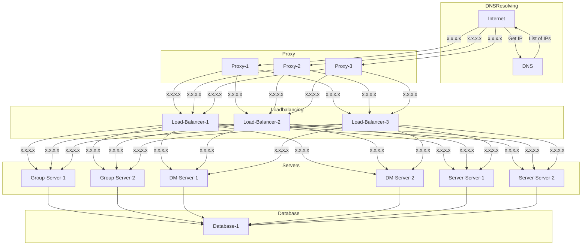

# Server architecture


- Single DNS-record can contain [multiple IP-addresses](https://www.digitalocean.com/community/tutorials/how-to-configure-dns-round-robin-load-balancing-for-high-availability)
- Network traffic gets first processed by proxies. These handle [HTTPS certificates](https://letsencrypt.org). Every proxy knows every load-balancer. That way $\frac{n-1}{n}$ proxies and balancers can die.  
  ```ad-example
  Proxy-1, Proxy-3, Load-balancer-1 and Load-balancer-2 die. That way traffic can still flow through Proxy-2 and Load-Balancer-3.
  ```
- The Load-Balancers balance the load over the different servers. When the load gets too high, additional containers can be started / stopped on demand, depending on the current situation.
```ad-warning
Current Problem:
Currently, a single database is used. MySQL is thread safe (using row / table locking), no mutliple accesses should'nt be a problem.
**But:** A single database is a single point of failure and is therefore unsafe. In theory multiple databases are required. These however have to be somehow kept in sync.
```ad-info
Ideas:
- Execute DB calls on all databases
- Have a single DB running and monitor it. When it dies, start a new one
- Run multiple databases, keeping them in sync by using the underlying filesystem, for example by symlinking or a filesystem like [mergerfs](https://github.com/trapexit/mergerfs) or [mdadm](https://raid.wiki.kernel.org/index.php/A_guide_to_mdadm)
```ad-warning
Another point to consider: Performance
```
```
```
- The proxies, load-balanders, servers and database(s) are packages in [docker](https://www.docker.com/) containers, allowing for quick and simple deployment, as well as the use of [Kubernetes](https://kubernetes.io) when the necessity arises